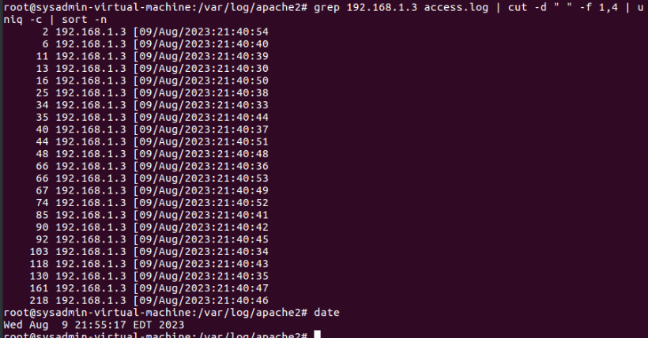

<div align="center">

# Apache Log Analysis — Bash Scripting
### CySA+ Lab · Ethical Hacking · CIS196 · Cypress College

[]()
[]()
[]()

</div>

---

## Overview

```text
Objective  : Detect and distinguish normal vs. malicious web traffic using bash scripting
Environment: Ubuntu (Apache server) · Kali Linux (attacker) · WinClient · Windows 2012 R2
Network    : 192.168.1.0/24 — LAN-only segmented lab environment
Date       : August 2023
Course     : CIS196 Ethical Hacking (CySA+ aligned) — Cypress College
```

Used bash scripting to analyze Apache2 access logs across a four-machine lab network. Generated legitimate web traffic from a Windows client, then simulated an attack using OWASP ZAP from Kali Linux. Used CLI tools — `grep`, `cut`, `sort`, and `uniq` — to surface anomalies, identify attacker IP addresses, measure connection rates, and detect user-agent spoofing. This mirrors a real SOC analyst workflow: establish a baseline, introduce attack traffic, then hunt the anomaly in raw log data.

---

## Lab Environment

| Machine | Role | IP |
|---|---|---|
| Ubuntu | Apache2 web server — target | 192.168.1.4 |
| WinClient | Legitimate user generating normal traffic | 192.168.1.5 |
| Kali Linux | Attacker running OWASP ZAP scanner | 192.168.1.3 |
| Windows 2012 R2 | Domain controller | 192.168.1.2 |

---

## What is Apache?

Apache2 is one of the most widely deployed open-source web servers in the world. On Linux systems, Apache stores access logs at `/var/log/apache2/access.log`. Every HTTP request to the server — whether from a browser, a bot, or an attacker — gets written to this file in a structured format.

Each log entry captures: client IP, identity, authenticated user, timestamp, HTTP request, status code, response size, referer, and user-agent string. Understanding this format is the foundation of log analysis — you can't detect anomalies in data you don't understand.

---

## Bash Scripting in Security Operations

Bash scripting allows analysts to automate repetitive CLI tasks — parsing logs, filtering output, counting occurrences, and flagging anomalies — without needing a full SIEM. In security operations, bash pipelines are used to quickly triage large log files during incident response, hunt for IOCs, and build lightweight detection logic that runs on any Linux system.

| Command | Purpose in log analysis |
|---|---|
| `grep` | Filter log lines matching a specific IP, string, or pattern |
| `cut` | Extract specific fields from structured log data by delimiter |
| `sort` | Order output alphabetically or numerically for pattern recognition |
| `uniq -c` | Count consecutive duplicate lines — surfaces frequency anomalies |
| `wc -l` | Count total lines — quickly measure traffic volume |

---

## HTTP Status Codes

| Range | Meaning | Example |
|---|---|---|
| 100–199 | Informational — request received, continuing | 100 Continue |
| 200–299 | Success — request completed | 200 OK |
| 300–399 | Redirection — further action needed | 301 Moved Permanently |
| 400–499 | Client error — bad request or unauthorized | 404 Not Found |
| 500–599 | Server error — server failed to fulfill valid request | 500 Internal Server Error |

In the OWASP ZAP scan output, the log was flooded with 400-range errors — a strong indicator of automated scanning behavior probing for vulnerabilities.

---

## What I Did

### Task 1 — Examine the Apache log format

Navigated to the Apache log directory on Ubuntu and examined the `access.log` file structure:

```bash
cd /var/log/apache2
cat access.log.1
# 192.168.1.3 - - [30/Mar/2018:17:20:51 -0500] "\x16\x03\x01" 400 0 "-" "-"
```

Each field maps to: `IP · identity · auth · timestamp · request · status · bytes · referer · user-agent`

---

### Task 2 — Generate and baseline normal traffic

Cleared the log to start fresh, then used WinClient to browse the Apache server — establishing a baseline of legitimate entries.

```bash
# Clear the log
printf "" > /var/log/apache2/access.log

# Verify baseline after WinClient browsing
cat /var/log/apache2/access.log | wc -l
# Result: 4 lines — 2 page requests × 2 resources each
```

---

### Task 3 — Generate attack traffic with OWASP ZAP

Launched OWASP ZAP from Kali Linux and ran an automated scan against `http://192.168.1.4`.

```bash
# Count entries after ZAP scan
cat /var/log/apache2/access.log | wc -l
# Result: 1548 total — 4 legitimate · 1,544 from the attacker
```

---

### Task 4 — Analyze logs with bash scripting

**Count unique IPs:**
```bash
cat access.log | cut -d " " -f 1 | sort -u | wc -l
# Result: 2
```

**Identify the IPs:**
```bash
cat access.log | cut -d " " -f 1 | sort -u
# 192.168.1.3  ← Kali (attacker)
# 192.168.1.5  ← WinClient (legitimate)
```

**Count connections per IP:**
```bash
cat access.log | cut -d " " -f 1 | sort | uniq -c | sort -n
#    4  192.168.1.5   ← normal
# 1544  192.168.1.3   ← attacker
```

**Measure connection rate — confirm the attack:**
```bash
grep 192.168.1.3 access.log | cut -d " " -f 1,4 | uniq -c | sort -n
```



The output shows 192.168.1.3 sending up to **218 requests in a single second**. Normal user behavior generates 2–4 requests per page load. This is not human traffic.

**Detect user-agent spoofing:**
```bash
cat access.log | cut -d '"' -f 6 | sort | uniq -c | sort -n
#    1  Mozilla/4.0 (compatible; MSIE 6.0; Windows NT 5.0)   ← spoofed Windows 2000
#    4  Mozilla/5.0 (Windows NT 10.0; Win64...)               ← WinClient (legitimate)
# 1543  Mozilla/5.0 (Windows NT 6.3; WOW64...)               ← ZAP scanner (spoofed)
```

The ZAP scanner spoofed two separate user-agent strings — claiming to be both Windows 2000 and Windows 8.1 — while the legitimate user consistently identified as Windows 10.

---

## Key Findings

| Indicator | Value | Verdict |
|---|---|---|
| Total log entries | 1,548 | — |
| Legitimate requests | 4 | Normal |
| Attacker requests | 1,544 | Malicious |
| Peak requests/second | 218 | Attack confirmed |
| Unique attacker user-agents | 2 (both spoofed) | Evasion attempt |
| Detection method | Volume + rate + user-agent analysis | Detected via CLI only |

---

## Concepts Demonstrated

- Apache2 log format parsing and field mapping
- Bash pipeline construction: `cat · cut · sort · uniq · grep · wc`
- Traffic baseline establishment before attack simulation
- Volume-based anomaly detection without a SIEM
- User-agent string analysis and spoofing detection
- OWASP ZAP automated scanner behavior and log footprint
- Attack detection using raw CLI tools only

---

## What I'd Do Differently in Production

**Automated rate alerting.** A real-time script monitoring connection rate per IP — firing an alert when any single source exceeds a threshold (e.g. 10 req/sec) — would catch this within the first few seconds of the scan.

**SIEM integration.** Forwarding Apache logs to Splunk or Elastic would surface volume anomalies automatically with dashboards, geo-IP lookup on the attacker, and correlation across multiple log sources simultaneously.

**WAF / rate limiting.** Apache's `mod_evasive` or an upstream WAF like ModSecurity would have blocked ZAP's scan automatically — rate-limiting the IP or returning 429 responses and dropping the connection before 1,500 entries accumulated.

**IP reputation enrichment.** Cross-referencing source IPs against threat intel feeds (AbuseIPDB, AlienVault OTX) would flag known malicious actors before manual analysis even begins.

---

## Related

[](https://github.com/Mvrcoz)
[](https://tryhackme.com/p/Marcoz)
[](https://www.linkedin.com/in/marcoz-tech/)

`bash` `log-analysis` `apache` `owasp-zap` `kali-linux` `incident-detection` `grep` `cybersecurity` `cysa-plus`
